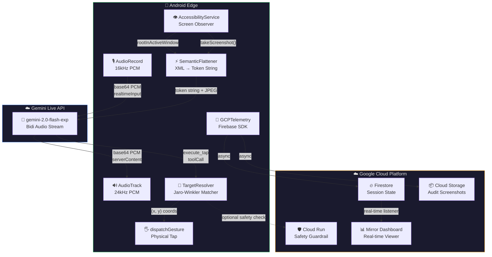
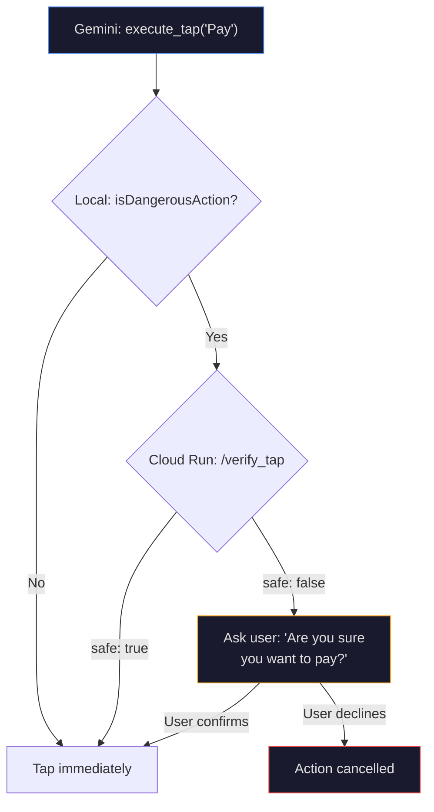

# Aura 4.0 — System Architecture

## Overview

Aura is a **voice-native, multimodal OS controller** for Android. Users speak to their phone; Aura **sees** the screen, **understands** intent via Gemini Live, and **physically taps** the correct UI element.

## Architecture Diagram

## Data Flow — The 600ms Loop

| Step | Component | Action | Latency Budget |
|------|-----------|--------|----------------|
| 1 | AudioRecord | Capture voice → base64 PCM chunk | ~64ms |
| 2 | WebSocket | Send `realtimeInput.mediaChunks` to Gemini | ~50ms |
| 3 | Gemini Live | Process intent → trigger `execute_tap` tool call | ~300ms |
| 4 | TargetResolver | Fuzzy match target text → calculate (X,Y) | <10ms |
| 5 | AccessibilityService | `dispatchGesture()` at resolved coordinates | ~50ms |
| 6 | GCPTelemetry | Async: log to Firestore + upload screenshot | 0ms (non-blocking) |

**Total E2E: ~475ms** (target <600ms)

## Component Summary

### Edge (Android Kotlin)

| File | Role | Key Detail |
|------|------|------------|
| `LiveSDKManager.kt` | Ears & Voice | OkHttp WSS → Gemini Live, bidi PCM |
| `AuraAccessibilityService.kt` | Eyes & Hands | Screen detection, screenshot, `dispatchGesture` |
| `SemanticFlattener.kt` | UI Compressor | Tree → `[i:ID\|t:Type\|txt:Text\|b:Bounds]` |
| `TargetResolver.kt` | Fuzzy Matcher | Jaro-Winkler, 0.75 threshold, dangerous action check |
| `GCPTelemetry.kt` | Cloud Sync | Firestore + Cloud Storage, async fire-and-forget |

### Cloud (GCP)

| Service | Role | Region |
|---------|------|--------|
| Cloud Run | Safety guardrail API + Mirror Dashboard | asia-south1 |
| Firestore | Real-time session state + action logs | auto |
| Cloud Storage | Audit trail screenshots | auto |

## Safety Guardrail Flow

